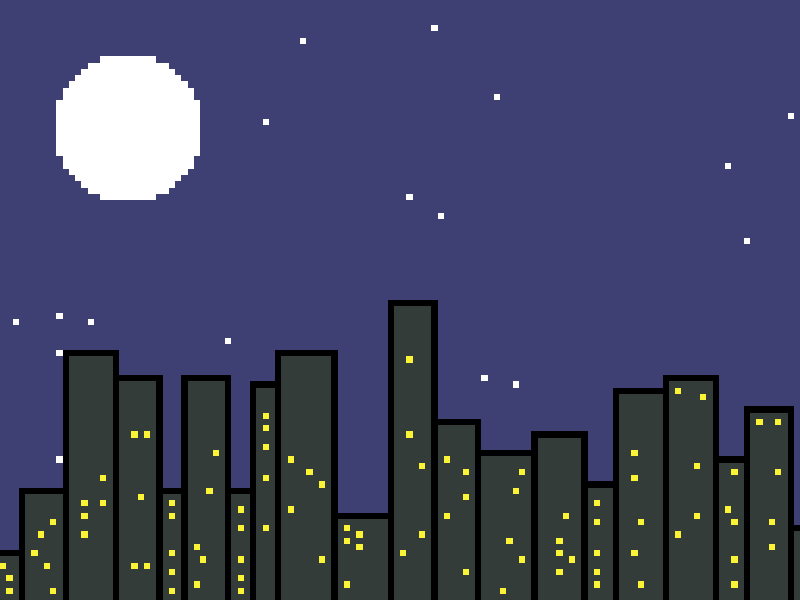

# skyline



## Usage

```plain
skyline 0.1.0
Displays a procedurally-generated scrolling city skyline

USAGE:
    skyline.exe [OPTIONS]

OPTIONS:
    -b, --border-color <BORDER_COLOR>
            Color of the building borders [default: #000000]

    -B, --background-color <BACKGROUND_COLOR>
            Color of the building background [default: #323c39]

    -d, --window-distance <WINDOW_DISTANCE>
            Minimum distance between windows [default: 2]

    -D, --star-distance <STAR_DISTANCE>
            Minimum distance between stars [default: 5]

    -f, --fps <FPS>
            Frames per second for the animation [default: 30]

    -h, --help
            Print help information

    -m, --moon-radius <MOON_RADIUS>
            Radius of the generated moon [default: 12]

    -s, --stars <STARS>
            Number of stars to generate [default: 20]

    -S, --sky-color <SKY_COLOR>
            Color of the sky [default: #3f3f74]

    -T, --star-color <STAR_COLOR>
            Color of the stars [default: #ffffff]

    -V, --version
            Print version information

    -w, --windows <WINDOWS>
            Maximum number of windows to generate for each building [default: 5]

    -W, --window-color <WINDOW_COLOR>
            Color of the windows [default: #fbf236]
```
